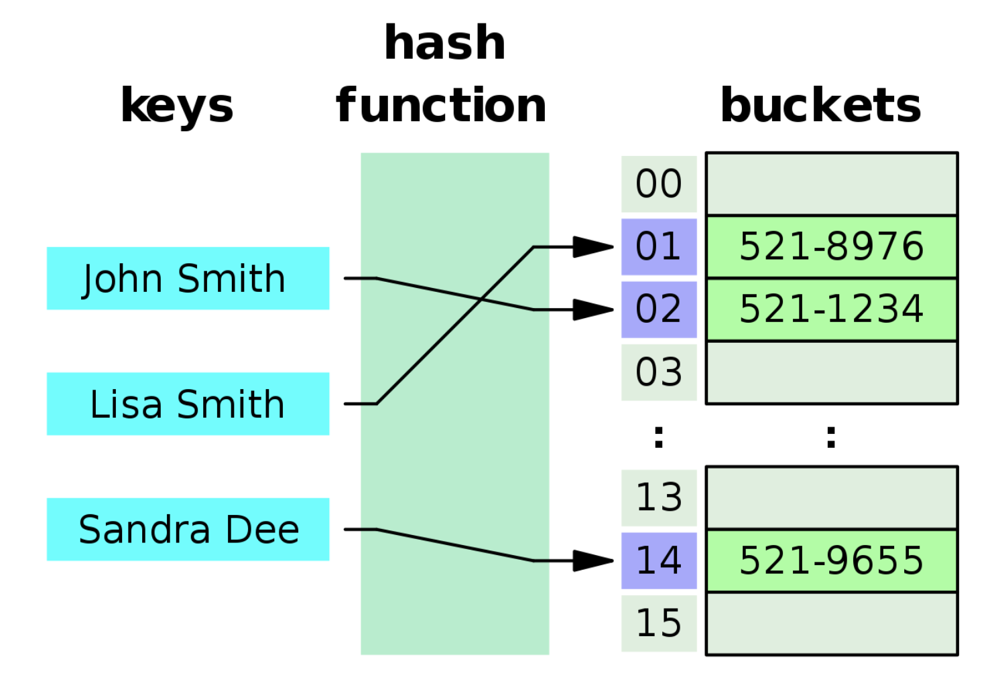
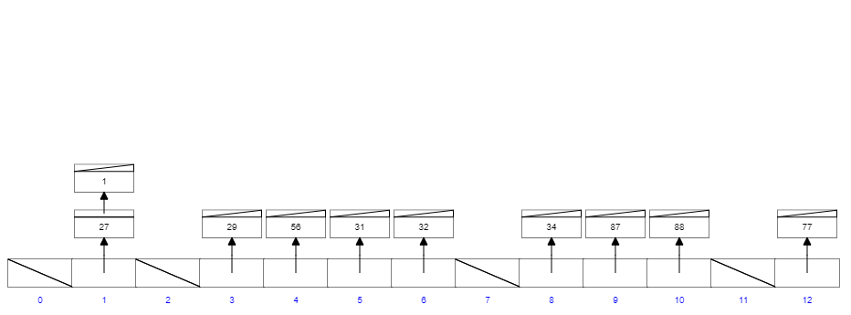

此篇為 [Udemy - Master the Coding Interview: Data Structures + Algorithms](https://udemy.com/course/master-the-coding-interview-data-structures-algorithms/?srsltid=AfmBOooCR7IyhxoDQK1cx6-Q*sh7WOI7Q3Z1LnW005R5rxfs5cmnDXo*)
課程筆記。

上篇介紹了如何用 JavaScript 的 Object，實作 Array 的資料結構，這篇則要來解釋 JavaScript 最核心的概念——物件（Object）。

講到 JavaScript 當中的物件，你可能會想到的是像以下的資料結構：

```jsx
let user = {
  id: 1,
  name: "John Doe",
  age: 20,
};
```

由此可以看出 Object 是由`key: value`組成，那在 RAM 當中，他又是怎麼被儲存的？這時我們必須要了解 Hash Tables 的資料結構。

<!-- truncate -->

### Hash Tables



Hash Tables 在不同語言當中，有不同的實現方式，而在 JavaScript 當中，Hash Tables 這個資料結構就是以 Object 的方式呈現。

Hash Tables 的運作方式，可以把他想成，假設我有一塊空地。這塊空地上有 100 個坑。而我手上剛好有 10 個蘿蔔，現在我要把這 10 個蘿蔔放進去這些坑裡面。

那問題來了，我要怎麼決定哪個蘿蔔放進哪個坑裡面？

這時我決定用一個轉盤，當轉盤轉到 2，我就把第一個蘿蔔放在 2 號坑，當轉盤轉到 78，我就把第二個蘿蔔放到 78 號坑。

沒錯，看到這裡，你已經學會 Hash Tables 的運作方式了。

我們可以把那塊「空地」想成記憶體，「坑」想成記憶體位址，「蘿蔔」想成資料，而轉盤想成 hash function。當我想把一對`key: value`塞進去記憶體時，會將 key 放進 hash function，進而得出我想要把這個資料放在哪一個記憶體位址。

但是，當我第一個轉盤轉到 2 的時候，我把蘿蔔放到 2 號坑，那我下一次轉盤也轉到 2 的時候，我的蘿蔔還是放在 2 號坑嗎？

這就是 hash collision，在 JavaScript 裡，當遇到這種情況的時候，答案是「是」，他可以放在同一個坑裡。並且會用 Linked List 的方式存在這個記憶體位址。



不過，這些 hash function 和 hash collision 遇到的問題，其實語言本身都已經幫我們處理好了，所以我們平常在 coding 的時候，不會遇到這些問題。

### Implementation

接下來我們也要來挑戰，用 JavaScript 來實作一個 Hash Tables 的 Class。

首先在 constructor 裡面，建立一個 data 變數，並可以傳入 size 來決定這個 hash table 的大小。

```jsx
class HashTables {
  constructor(size) {
    this.data = new Array(size);
  }
}
```

接著我們要在 Class 中新增 hash function，這個 function 會接收 key 值，並決定要將這個資料放在 hash table 的哪一個位址。

```jsx
_hash(key) {
  let hash = 0;
  for (let i = 0; i < key.length; i++) {
    hash += key.charCodeAt(i);
  }
  return hash % this.table.length;
}
```

在這裡讓傳進來的 key 當中的每一個字母跑迴圈，透過`charCodeAt()`轉成數字後並相加，就可以得出那個 key 的 hash。

假如我想要存一個`apple: 500`的資料，`apple`這個 key 就會經過 function 後得出一個 hash。最後需要`hash`除以`this.table.length`的餘數，是為了確保這個 hash 值是落在我擁有的記憶體位址範圍裡面。

比如 hash = 102 時，我的 hash table 只有 100 個位址，因此我用 102 % 100 = 2 的方式，決定將這個資料放在 2 號坑。而`_hash`會加底線是為了表明這是一個 private function。

接下來繼續加上一些基本的 Object 能使用的 method：

### Set

首先，要 set 一個資料到 hash table 裡面，必須將傳進來的 key 經過 hash function 得到到放進去的位址。接著在這個位址塞進一個空陣列（此處以 Array 為示範，而非 Linked List）。

這個空陣列就是剛剛所說的「坑」，push 就是將蘿蔔塞進去坑的動作，最後回傳這個 hash table。

```jsx
set(key, value) {
  let address = this._hash(key);
  if (!this.data[address]) {
    this.data[address] = [];
  }
  this.data[address].push([key, value]);
  return this.data;
}
```

**Big O: O(1)**

藉由 Hash 就能快速新增 key: value

### Get

接著要實作`get()`，首先可以從 key 找到對應的 hash 位址，得到對應的「坑」（陣列）的資料。

但因為這個「坑」（陣列）可能不只一個資料，所以要用迴圈去比對一樣的 key，就可以找到 key 對應的 value。若找不到則回傳 undefined。

```jsx
get(key) {
  const address = this._hash(key);
  const currentBucket = this.data[address];
  if (currentBucket) {
    for (let i = 0; i < currentBucket.length; i++) {
      if (currentBucket[i][0] === key) {
        return currentBucket[i][1]
      }
    }
  }
  return undefined;
}
```

**Big O: O(1)**

大部分的情況下，沒有 hash collision，一個 address 只有一個 key: value，Big O 為 O(1)，藉由 Hash 就能快速定位要找資料。

若有 hash collision，就必須跑迴圈，Big O: O(n)

### Keys

`Object.keys()`可以用來取得 Object 所有的 key。

這裡我們假設每一個坑都只有一個蘿蔔的情況，將 this.data 跑迴圈，去檢查是否所有的 hash 位址都有東西。

如果有東西，我要去取得這個「坑」（陣列）裡面的 key。

```jsx
keys(){
  const keysArray = [];
  console.log(this.data.length);
  for (let i = 0; i < this.data.length; i++){
    if(this.data[i]){
      // 第 i 號的坑的第一個 pair
      keysArray.push(this.data[i][0][0])
    }
  }
  return keysArray;
}

```

**Big O: O(n)**

需將 this.data 跑迴圈，去檢查是否所有的 hash 位址都有東西。

全部的 Class 看起來像這樣：

```jsx
class HashTable {
  constructor(size) {
    this.data = new Array(size);
  }

  _hash(key) {
    let hash = 0;
    for (let i = 0; i < key.length; i++) {
      hash = (hash + key.charCodeAt(i) * i) % this.data.length;
    }
    return hash;
  }

  set(key, value) {
    let address = this._hash(key);
    if (!this.data[address]) {
      this.data[address] = [];
    }
    this.data[address].push([key, value]);
    return this.data;
  }

  get(key) {
    const address = this._hash(key);
    const currentBucket = this.data[address];
    if (currentBucket) {
      for (let i = 0; i < currentBucket.length; i++) {
        if (currentBucket[i][0] === key) {
          return currentBucket[i][1];
        }
      }
    }
    return undefined;
  }

  keys() {
    const keysArray = [];
    console.log(this.data.length);
    for (let i = 0; i < this.data.length; i++) {
      if (this.data[i]) {
        keysArray.push(this.data[i][0][0]);
      }
    }
    return keysArray;
  }
}

const myHashTable = new HashTable(50);
myHashTable.set("grapes", 10000);
myHashTable.set("grapes", 10000);
myHashTable.get("grapes");
myHashTable.set("apples", 9);
myHashTable.get("apples");
myHashTable.keys();
```

最後，在 JavaScript 除了一般的`let obj = {}`以外，還有另外兩個特別的 Object，分別是`Map`和`Set`。

### Object、Map、Set

**Object**

JavaScript 的 Object 在新增時是沒有順序性的，不像 Array 那樣從 0 開始，往上增加。

另外，Object 裡的 prototype，如`hasOwnProperty()`是可以被改寫的。

```jsx
const obj = {};
obj.name = "Nathan";
obj.hasOwnProperty = true;

console.log(obj.hasOwnProperty("name"));
// Error: obj.hasOwnProperty is not a function
```

**Map**

而 Map 的運作方式則是跟一般 Object 不太一樣，Map 在 insert 資料時是有順序性的，並且不能覆寫他的 prototype。

```jsx
const collection = new Map();

collection.set("Nathan", "555-0182");
collection["size"] = false;

console.log(collection.get("size")); // undefined
console.log(collection.size); // 1
```

**Set**

Set 跟 Map 的運作方式很像，insert 資料時是有順序性的，只是 Set 只會儲存 key，沒有 value。

Set 裡面的 key 絕對不會重複，因此如果要確認 Array 裡面的值有沒有重複，可以用`Set().size`來檢查。

```jsx
let a = [1, 2, 3, 3, 5];

function hasDuplicate(arr) {
  return new Set(arr).size !== arr.length;
}

hasDuplicate(a); // true
```

以上就是 Hash Tables 的介紹，以及用 JavaScript 來實作 Hash Table Class 的方式！

### Pros & Cons

- Pros

1. Fast lookup (good collision resolution needed)
2. Fast inserts
3. Flexible keys (not only number (Array))

- Cons

1. Unordered
2. Slow key iteration (Object.keys())

### Reference

[Udemy - Master the Coding Interview: Data Structures + Algorithms](https://udemy.com/course/master-the-coding-interview-data-structures-algorithms/?srsltid=AfmBOooCR7IyhxoDQK1cx6-Q*sh7WOI7Q3Z1LnW005R5rxfs5cmnDXo*)
