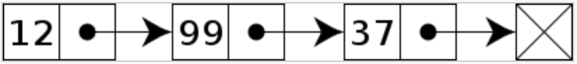
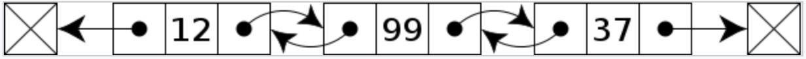

此篇為 [Udemy - Master the Coding Interview: Data Structures + Algorithms](https://udemy.com/course/master-the-coding-interview-data-structures-algorithms/?srsltid=AfmBOooCR7IyhxoDQK1cx6-Q*sh7WOI7Q3Z1LnW005R5rxfs5cmnDXo*)
課程筆記。

這篇要來介紹的是 Linked List，在 JavaScript 當中沒有原生的 Linked List 資料結構。初次學習的時候會覺得，為什麼還要多一種資料結構？不是用 Array 就好了嗎？仔細了解才發現 Linked List 的優點在哪裡。

之前在介紹 Array 的時候有提到，Array 在記憶體的儲存方式，是一個空位放一個值，如果在 Array 中新增一個值，一般來說是 O(1)。

但如果在記憶體中，他的後面一格剛好不是空的，這時候就要把整個 Array 搬去記憶體的另一塊空地，造成 Big O 可能是 O(n) 的狀況。

<!-- truncate -->

Linked List 的結構就比較彈性了，大家不用黏在一起，只要我一開頭的這個值，多一個空間儲存箭頭，這個箭頭指向我的下一個值，就能解決 Array 需要全部黏在一起的問題。



而他的缺點就是，每個值（Linked List 稱為 node，節點），需要有自己本身的值 ＋ 箭頭，所以要用到的記憶體就比較多。並且要找到一個特定值，會需要 traverse。

那接下來就用 JavaScript 來實做看看 Linked List 吧！

### Node

首先一個 node（節點）會有剛剛上述所說的，自己的值（value）+ 指向下一個值的箭頭（next）。

```jsx
const newNode = {
    value: value,
    next: null
}
```

每一個 Linked List 都會有頭（head）和尾（tail），尾巴的 next 會指向 null，代表 Linked List 的結束。

### Implementation

先創建一個 Linked List 的 class，有 head, tail 以及 length。

```jsx
class LinkedList {
  constructor(value) {
    this.head = {
      value: value,
      next: null
    };
    this.tail = this.head;
    this.length = 1;
  }
}

let myLinkedList = new LinkedList(10);

// looks like
myLinkedList: {
    head: {value: 10, next: null},
    tail: {value: 10, next: null},
    length: 1
}
```

### append()

要在 Linked List 的尾巴加上新的 node：

1. 把 tail 指向 newNode
2. tail 變成 newNode
3. length + 1

```jsx
append(value) {
    const newNode = {
      value: value,
      next: null
    }
    this.tail.next = newNode;
    this.tail = newNode;
    this.length++;
    return this;
}

let myLinkedList = new LinkedList(10);
myLinkedList.append(5);
myLinkedList.append(16)
// 10 -> 5 -> 16
```

**Big O: O(1)**

### prepend()

在 Linked List 最前面加上一個 node：

1. newNode 的 next 指向原本的 head
2. head 變成 newNode
3. length + 1

```jsx
prepend(value) {
    const newNode = {
      value: value,
      next: null
		}
    newNode.next = this.head;
    this.head = newNode;
    this.length++;
    return this;
}

let myLinkedList = new LinkedList(10);
myLinkedList.append(5);
myLinkedList.append(16);
myLinkedList.prepend(1)
// 1 -> 10 -> 5 -> 1
```

**Big O: O(1)**

### insert()

在指定的 index 新增一個 node，這時候需要 traverse：

1. traverse 到 index 的前一個 node（leader）
2. 將 leader 的 next 先存在 holding pointer
3. 把 leader 的 next 指向 newNode
4. 把 newNode 指向 holding pointer
5. length + 1

```jsx
insert(index, value){
    // Check for proper parameters;
    if (index === 0) {
      return this.prepend(value);
    }

    if(index >= this.length) {
      return this.append(value);
    }

    const newNode = {
      value: value,
      next: null
    }

    const leader = this.traverseToIndex(index-1);
    const holdingPointer = leader.next;
    leader.next = newNode;
    newNode.next = holdingPointer;
    this.length++;
    return this;
  }

  traverseToIndex(index) {
    let counter = 0;
    let currentNode = this.head;
    while(counter !== index){
      currentNode = currentNode.next;
      counter++;
    }
    return currentNode;
  }

let myLinkedList = new LinkedList(10);
myLinkedList.append(5);
myLinkedList.append(16);
myLinkedList.prepend(1);
// 1 -> 10 -> 5 -> 16
myLinkedList.insert(2, 99);
// 1 -> 10 -> 99 -> 5 -> 16
// leader: 10
// holding pointer: 5
// leader.next = newNode -> make 10 points to 99
// newNode.next = holdingPointer -> make 99 points to 5
myLinkedList.insert(20, 88);
// 1 -> 10 -> 99 -> 5 -> 16 -> 88
```

**Big O: O(n)**

雖然最差情況是 traverse 整個 Linked List，但仍比 Array 整個移動 Index 的表現還好。

### remove()

移除指定 index 的 node，一樣需要 traverse：

1. traverse 到 index 的前一個 node（leader）
2. 把要移除的 node（unwantedNode）先存起來
3. 把 leader 指向 unwantedNode 的下一位
4. length - 1

```jsx
remove(index) {
    const leader = this.traverseToIndex(index-1);
    const unwantedNode = leader.next;
    leader.next = unwantedNode.next;
    this.length--;
    return this;
}

let myLinkedList = new LinkedList(10);
myLinkedList.append(5);
myLinkedList.append(16);
myLinkedList.prepend(1);
// 1 -> 10 -> 5 -> 16
myLinkedList.remove(2);
// 1 -> 10 -> 16
// leader: 10
// unwantedNode: 5
// leader.next = unwantedNode.next -> make 10 points to 16
```

**Big O: O(n)**

### reverse()

Linked List: `1 -> 10 -> 5 -> 16 (-> null)`

Reversed: `(null <-) 1 <- 10 <- 5 <- 16`

```
第一輪：
- first：1
- second：10
- third (second.next/temp)：5
```


1. 先抓 first 跟 second，讓 second 指向 first：（1 跟 10）變成 `10 -> 1`
2. 準備做下個 loop，再抓 second 跟 third（10 跟 5）
3. 把 second 變成 first，third 變成 second（10 變成 first，5 變成 second）
4. 重複第一步：（10 跟 5）變成 `5 -> 10`
5. 找不到 second 的時候停止
6. 交換頭尾，記得把尾指向 null

最終結果：`16 -> 5 -> 10 -> 1 (-> null)`

```jsx
reverse() {
    if (!this.head.next) {
        return this.head;
    }

    let first = null
    let second = this.head

    while(second) {
        const temp = second.next;
        second.next = first;
        // 準備做下個 loop
        first = second;
        second = temp;
    }

    return this;
}
```

**Big O: O(n)**

### Doubly Linked List



上面介紹的都是單向的 Singly Linked List，但其實還有雙向的 Doubly Linked List。

它的 node 會同時儲存前一個（prev）跟後一個（next）的 node，比較佔記憶體，但相對的它能夠達成雙向的 traverse。

```jsx
const newNode = {
    value: value,
    next: null,
    prev: null
}
```

### Pros & Cons

- Pros

1. Fast insertion
2. Fast deletion
3. Ordered
4. Flexible size
    
- Cons

1. Slow lookup
2. More memory

### Reference

[Udemy - Master the Coding Interview: Data Structures + Algorithms](https://udemy.com/course/master-the-coding-interview-data-structures-algorithms/?srsltid=AfmBOooCR7IyhxoDQK1cx6-Q*sh7WOI7Q3Z1LnW005R5rxfs5cmnDXo*)
